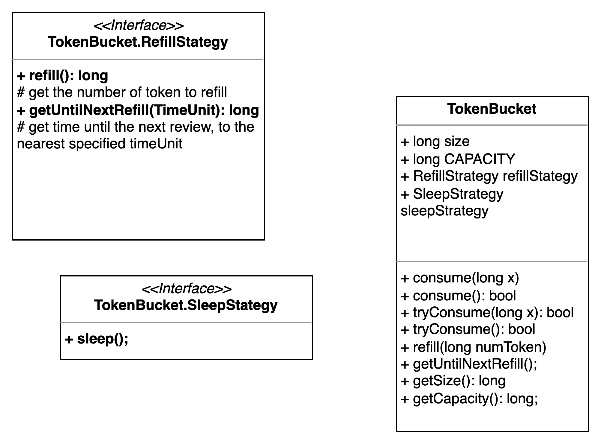

# Rate Limiter token bucket algorithm

Inspired by: https://github.com/bbeck/token-bucket/tree/master

## Description

**High Level Design**
- A bucket contains a set number of token.
- The bucket will be refilled after every set time.
- Every request comes in will try to consume one token:
  - If there is still available token, the number of token will decrease.
  - Else, the request will be dropped. The algorithm will return the number of times before the next refill.

**Classes**

